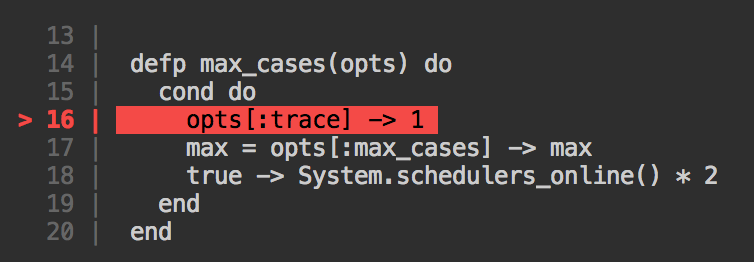

# CodeFrame

Build code frames that point to a specific location. Inspired by [@babel/code-frame](https://github.com/babel/babel/tree/master/packages/babel-code-frame). This is
mainly useful for error locations (syntax errors, etc).

Screenshot of colorized output:



## Installation

The package can be installed by adding `code_frame` to your list of
 dependencies in `mix.exs`:

```elixir
def deps do
  [{:code_frame, "~> 0.1.0"}]
end
```

Don't forget to run `mix deps.get` to fetch the new dependencies.

## Usage

Building a custom codeframe is pretty straightforward. Just pass the string and
specify the line you want to draw attention to and thats it.

```elixir
defmodule Foo do
  import CodeFrame

  def main() do
    my_string = "foo\nbar\nbaz"

    # Args: build(string, highlighted_line, options)
    frame = build(my_string, 1, colors: true)

    IO.puts(frame)
  end
end
```

`build()` has the following options:

| Option | Description |
|---|---|
| `lines_before: integer` | Number of lines to show **before** the highlighted one. |
| `lines_after: integer` | Number of lines to show **after** the highlighted one. |
| `colors: boolean` | Force enabling/disabling of colorized output. |

## License

`MIT`, see [License file](./LICENSE.md).
